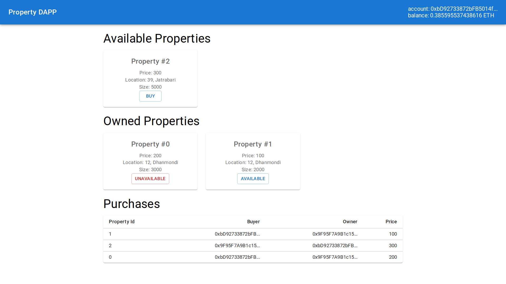

# Property DAPP

A Dapp built with `react` which uses `web3.js` to interact with `solidity` smart contracts hosted on the `rinkeby` blockchain. 



### Frontend

- `App.js` file holds a single page application 
- Smart contract functions
  - `loadWeb3` - initialize web3 and contracts
  - `getInitialData` - get property and purchase lists
  - `buyProperty` - new buy property transaction on the blockchain
  - `setPropertyAvailability` - modify availability of property on the blockchain

### Contracts

Contracts are located in the `src/contracts` folder

- `Registry.sol`
- `Property.sol`

The ABIs for the contracts are located in `src/abis` folder

### Setup

- Install `node.js` 
- Run `npm install` from project root to install packages
- Create a `.env` file in project root like the following and put your contract addresses
```env
PROPERTY_CONTRACT_ADDRESS=<here>
REGISTRY_CONTRACT_ADDRESS=<here>
```
- Install `metamask`, setup account
- Set network on `metamask` to 'Rinkeby Test Network' (if you deployed smart contracts to `rinkeby`). Might need to enable test networks in settings.
- Run `npm start` to run server and visit http://locahost:3000/
- Should get prompted by metamask to connect to the website. Accept it and you're good to go!
